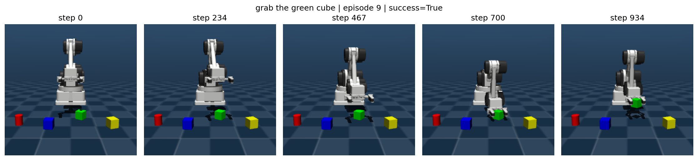

# 1. 목표

기존 파이프라인은 단일 문장 형식으로 원기둥을 색상에 따라 잡는 작업만
지원했다. 본 과제에서는 데이터셋의 물체와 작업 종류를 확장하고,
RaccoonBot 시뮬레이션 데이터가 OpenVLA 학습에 안전하고 일관되게
사용되도록 전체 변환 과정을 개선했다.

# 2. 데이터셋 확장

MuJoCo 수집기는 빨강, 파랑, 초록, 노랑의 네 가지 색상과 원기둥,
정육면체, 구의 세 가지 물체 형상을 지원한다. 같은 작업도 여러 자연어
명령으로 표현하도록 문장 템플릿을 추가했다. 또한 잡기 외에 밀기와
집어서 옮기기 작업을 생성하는 멀티태스크 수집기를 구현했다.

| 데이터셋 | 학습 에피소드 | 검증 에피소드 |
|---|---:|---:|
| `raccoon_grasp` | 1,080 | 120 |
| `raccoon_push` | 146 | 16 |
| `raccoon_pick_and_place` | 131 | 15 |

세 데이터셋은 OpenVLA의 `raccoon_task_balanced` 혼합 데이터셋으로
등록했다. 각 작업의 샘플링 가중치를 동일하게 설정하여 데이터가 많은
잡기 작업이 작은 두 작업을 압도하지 않도록 했다.

# 3. 코드 개선

## 3.1 action label 의미 수정

기존 변환기는 idle observation을 제거한 뒤 여러 원본 프레임에 걸친
이동량을 하나의 action으로 기록할 수 있었다. 이 때문에 비정상적으로
큰 Cartesian delta가 만들어졌다. 수정 후에는 보존된 observation마다
바로 다음 원본 프레임까지의 이동량만 label로 사용한다. 최종
task-balanced 데이터의 축별 최대 이동량은 약 4.9 mm 이하로,
클라이언트의 안전 제한과 일치한다.

## 3.2 물리적으로 타당한 demonstration

그리퍼는 물체에 접근하는 동안 열린 상태를 유지하고, grasp-height
조건에 도달한 뒤에만 닫힌다. 인위적으로 물체를 그리퍼에 붙이는
기능은 기본적으로 비활성화하여 실제 MuJoCo contact와 물리 계산으로
성공 여부가 결정되도록 했다. 배치 실패는 전체 수집을 종료하지 않고
해당 시도만 버린 뒤 재시도한다.

## 3.3 멀티태스크 안전성과 재현성

밀기와 집어서 옮기기 경로에 보간된 IK 사전 검사를 적용했다.
작업·색상·형상 조합별 균형 샘플링과 중단 후 재개 가능한 episode
번호 복구 기능도 추가했다. 수집기의 gripper label인
`0=open, 1=close`는 OpenVLA 규칙인 `1=open, 0=close`로 변환한다.

# 4. 학습 및 추론 결과

실행된 노트북 출력에는 A100 GPU에서 `openvla/openvla-7b`를 LoRA
rank 32, effective batch size 16, learning rate `2e-4`로 학습한 기록이
있다. 500, 1,000, 1,500 step에서 checkpoint 저장이 확인되었다.
과제 지침에 따라 모델 가중치는 Git에 포함하지 않았으며, 실행 기록의
일부를 `results/logs/training.log`에 보존했다.

`results/logs/inference_server.log`에는 checkpoint 로딩,
`raccoon_pick_place` 정규화 통계 로딩, 색상 기반 명령에 대한 7차원
action 예측 결과가 포함되어 있다.

# 5. 검증

- 변경된 데이터셋 및 OpenVLA 등록 모듈의 Python 문법 검사를 통과했다.
- action label 회귀 테스트를 통과했다.
- task-balanced 등록 및 TFDS 빌드 테스트를 통과했다.
- 세 데이터셋의 TFDS materialization을 완료했다.
- 실제 TFDS 성공 에피소드를 디코딩하여 시각화했다.

# 6. 한계와 향후 작업

새로운 멀티태스크 혼합 데이터에 대한 전체 OpenVLA 학습과 작업별
성공률 평가는 추가로 필요하다. 향후에는 동일 작업 가중치 방식과
원본 데이터 크기 비례 방식의 성능을 비교하고, 배포 GPU에서 추론
지연 시간을 측정할 예정이다.
